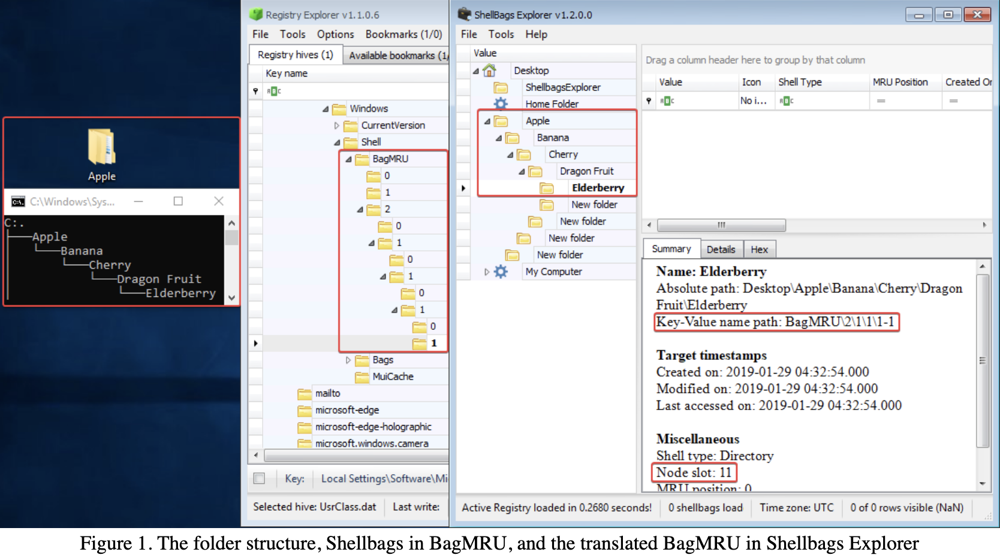
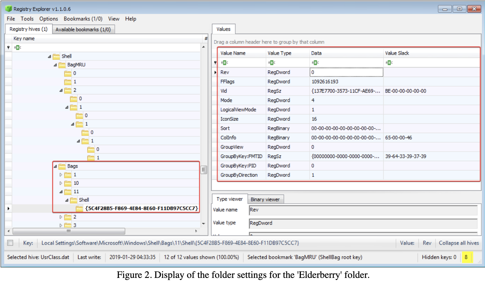
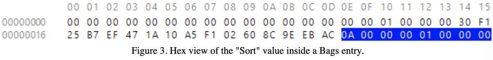
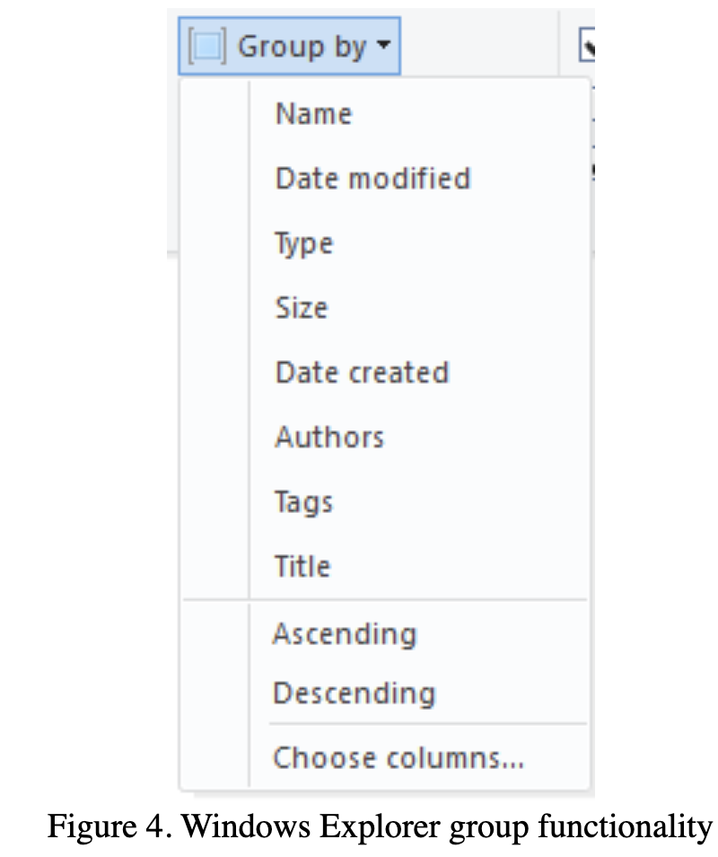
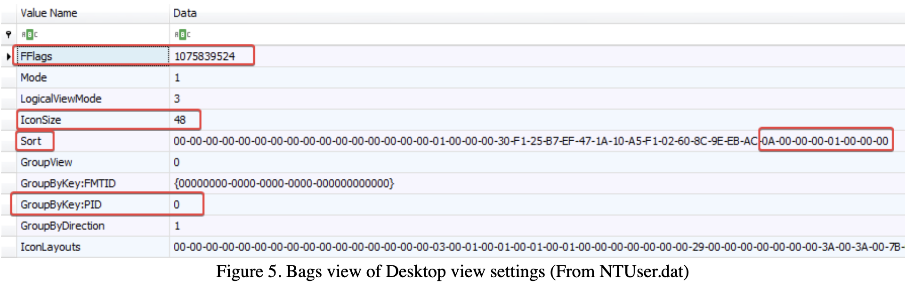
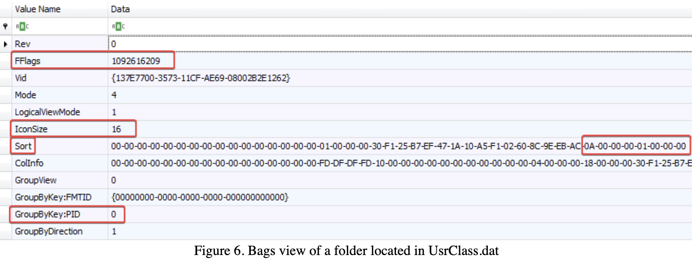
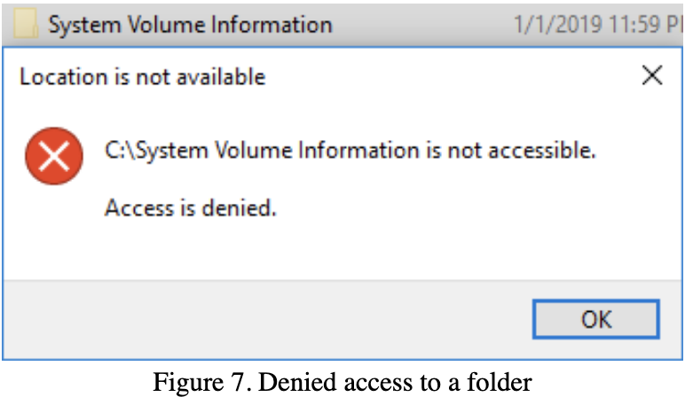
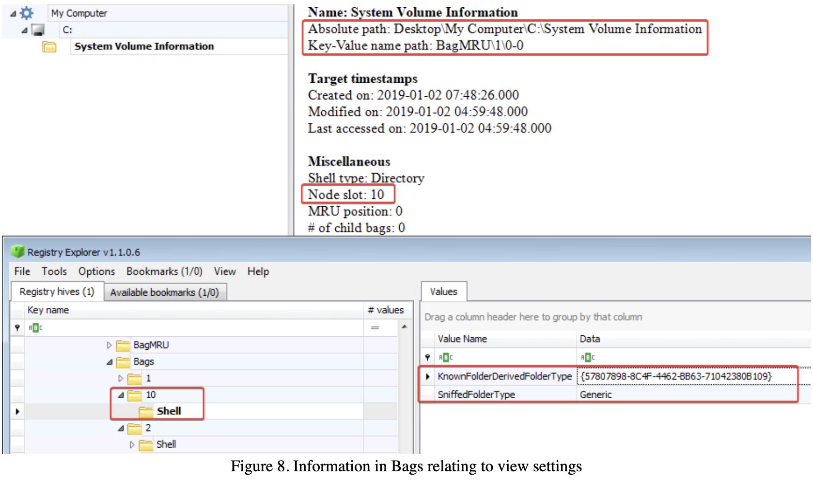

This blog post is in response to David Cowen's Weekly Challenge as seen in his Daily Blog #610.

The three questions I will be answering in this post include the following:
1. What within a ShellBags entry would tell you how the user had set their directory viewing preferences?
2. What is the default view if no settings are changed?
3. If a user attempts to access a directory where they are not permitted, what directory viewing settings are left behind?
***
What are these Shellbags we speak of? There are a lot of great resources published about an in-depth analysis of Shellbags, which made some introductory research of this topic easy to jump into. Shellbags are an artifact where the actions of the user are tracked when elements such as folders and ZIP files are accessed, renamed, clicked, cut, copied, or even deleted. This allows a forensicator to understand what folders or places a suspected user has accessed. After investigating further, these questions will pursue the other information that can be found within Shellbags. Since Windows tracks almost everything, it should be no surprise that there is some content about Shellbags that can be expanded on.

For my explanation, I’ve decided to use Windows 10 1709 (Build 16299.15) in a virtual machine. The system is freshly installed. Tools on this machine include FTK Imager, Procmon, Eric Zimmerman’s ShellbagsExplorer and RegistryExplorer.

So, onto those questions!

# 1. What within a ShellBags entry would tell you how the user had set their directory viewing preferences?

To start breaking down this question, I will first explain a little background information about the ways in which Shellbags are stored. There are quite a few locations that need to be checked and cross-referenced to get the answer to these questions.

Since I’m using Windows 10, the primary locations where I will be focusing are the following:
 * %UserProfile%\NTUSER.dat
 * %UserProfile%\AppData\Local\Microsoft\Windows\UsrClass.dat

The purpose of Shellbags in NTUSER.dat is to store information for the Desktop, shared network folders, remote machines, and remote folders. As on the other hand, the purpose of UsrClass.dat is to store some similar information from the Desktop and shared folders, but most importantly information about ZIP files, local folders, and remote folders (Lo, 2014). There are some key differences between the multiple locations of the artifacts regarding content, therefore, we should always keep both in mind when investigating.

Three components of Shellbags I would quickly like to cover are BagMRU, NodeSlot, and Bags. BagMRU is the parent registry key, which then has multiple sub-keys. Within these sub-keys, there can be more child entries which represent a deeper folder structure. An example shows this below.

To briefly break down Figure 1: a folder named ‘Apple’ was created and contains many sub-folders. On the far left is the ‘tree’ command run to show the original folder structure. The middle is the representation of UsrClass.dat when loaded into Registry Explorer. When loading this hive into Registry Explorer, you can find this key at `Local Settings\Software\Microsoft\Windows\Shell\BagMRU`. On the far right is Shellbags Explorer which does all of the hard work by parsing out and interpreting the information from BagMRU in UsrClass.dat. This also includes some time information and also the ‘Key-Value name path’ which directly aligns with the registry structure.

However, the meat and potatoes -- and most relevant part of what is contained here is ‘Node Slot.’ The node slot tells us what sub-key we need to look for in the ‘Bags’ key. This is interesting because each sub-folder (ie. Apple, Banana, Cherry, etc) has its own Node Slot. This means we will have access to information about user preferences from each folder… To move forward to the answer of this first question, I will focus on Node Slot 11 (The folder named ‘Elderberry’). Any information provided in it's "Bags" entry will include information about the folder's view preferences.

I located the 11 key in the Bags key, and clicking the generated GUID (This GUID tells us the folder type). After clicking, we are now provided with many fields that can be observed and broken down to determine what they do. However, spoiler, they relate to user preferences. 

I’ve created a list below to show my understanding of what these values relate to. Some pretty extensive testing was performed to figure out what values would change when compared to the current Explorer settings. I even played around with Procmon to see what values changed, and what they may relate to. I’ve only included the most relevant fields for the sake of this question.

## FFlags
This value has changed multiple times from the Desktop (Icon View) to Explorer itself in Details View. Some consistent values that I documented in Windows 10 are shown below. An [additional resource I found was from Ivanti](https://forums.ivanti.com/s/article/Auto-Arrange-icons-and-Align-icons-to-grid-setting-not-captured-in-Microsoft-Windows-10), however, I’m not sure what version of Windows 10 this refers to as my findings were different, but consistent. These values can definitely show some of the user settings when using the desktop, or if the user was within Windows Explorer it self.

| Default View Options on Desktop | 0x40200224 (1075839524) |
| Default View Options in File Explorer | 0x41200011 (1092616209)  |
| View Options -> Show Item Checkboxes | 0x49200001 (1226833921) |
| View Options -> Align Icons to Grid | 0x40200220 (1075839520) |

From my limited research, these were the only FFlag values I consistently received. There were other flags I was not able to identify.

## IconSize
This says it all in the name! The size of the icon is here and consistently changes with the current View setting. The value converted to decimal represents the thumbnails size in pixels. (ie. 16 = 16x16…)

## Sort
Understanding how the sort order is saved to UsrClass was interesting. The last 8 bytes of the sort value will determine which column is being sorted, along with its desired order. 

The leading four bytes (0A 00 00 00) represent the column (je, Name, Date Modified). As where the second four bytes (01 00 00 00) indicate that the column was ascending in order.

0A 00 00 00 01 00 00 00
Red = Column ID being sorted by. (Name in this case)
Blue = Order in which it is sorted. (Descending in this case)

Some results of the default columns I was able to generate are below. There are hundreds of more columns you can add to File Explorer, therefore I only covered the default columns.

**Column Identifiers**
|  Date Modified |  0e 00 00 00 |
| Item Type  |  0b 00 00 00 |
| Size  |  0c 00 00 00 |
|  Name | 0a 00 00 00  |

**Order Identifiers**
|  Ascending |  01 00 00 00 |
| Descending  |  ff ff ff ff |

Another example: Sort value ending in (0b 00 00 00 ff ff ff ff) will be sorted by the "Item Type" column in descending order. More column values are to be determined!

## ColInfo
Unfortunately I was unable to decode the format in which this data is stored in. It appears to be a structure, but nothing that is human-readable. If you happen to figure this out please reach out to me!

## GroupByKey:PID
This value is set for the “Group by” functionality in Windows Explorer.

This functionality will show us any potential grouping settings that were set in Explorer. It took some time, but I was able to decode most of the default values :)

| Category | GroupByKey:PID value |
| ------ | ------ | 
|  Name | 10  |
|  Date modified |  14 |
|  Type | 4*  |
|  Size |  12 |
| Date created  |  15 |
| Authors  |  4* |
|  Tags |  5 |
|  Title |  2 |

*It is still unknown why these two values were the same.

## Direct Response to Question 1:
There are many additional user options that can be determined when viewing the ‘Bags’ key inside UsrClass.dat. The sort order can easily be determined, along with the order in which the column is being sorted. We can also easily find the size of the thumbnails that are currently in use by referring to the ‘IconSize’ value. This will change if the user changes their view settings to Extra Large (256), Large (128), Medium (48), Small (32) or Details/Anything-alike (16). By understanding how Windows will display files within explorer, the investigator can make a definite prediction of the folder preferences.

***

# 2. What is the default view if no settings are changed?

There are two views that need to be taken into consideration. We have the view of the Desktop, and the view of the File Explorer. Both present the items in Windows differently by default. As where the Desktop is an icon-based approach with a grid, it is completely different than the list/icon view of the File Explorer. 

After reloading my VM to out-of-the-box settings, I proceeded to find the proper default settings for the two views.

Defaults of the Desktop:
 * FFlags set to Dec. 1075839524
 * Icon size set to 48x48
 * Sort order is by name (0x0A000000) and is descending (0x01000000)
 * The desktop is not grouped by default.

Defaults of File Explorer:
 * FFlags set to Dec. 1092616209 
 * IconSize: 16
 * Sort: By Name, Decending
 * File Explorer is not grouped by default.

The only differences in this case were the FFlags Value and the Icon Size value. However, do note that the File Explorer key contains values for ‘Vid’ and ‘ColInfo.’

***

# 3. If a user attempts to access a directory where they are not permitted, what directory viewing settings are left behind?

In a research paper published on the SANS Reading Room in 2014 (Windows Shellbags Forensics In-Depth by Vincent Lo), it was documented that in Windows Vista, 7, 8, and 8.1, a Shellbags folder will be created when a folder is created, clicked, right-clicked, opened, renamed, deleted, or copied (Lo, 2014). The subfolder will only be generated once the folder is opened, however, a base entry will still be added when the folder is clicked, even if the content (or lack thereof) is not shown to the user. 

I am targeting System Volume Information, which is a folder where which we cannot access the contents, however, we can still interact with the folder by clicking on it, double clicking it, and right clicking it. We do not have permission to perform any of the other operations, however, this will be enough to get some data generated.

So, when double-clicking the folder, we receive the following, as expected.

So to find the answer to the question, the UsrClass.dat file was extracted to get more information about the settings left in Shellbags. 

Immediately I found that the folder was added to the BagMRU list. I then took the Node Slot, and examined it in  the ‘Bags’ key in UsrClass.dat. As previously explained we cannot go into another sub-folder past the “Shell” folder because we do not have access to the System Volume Information folder, so it cannot have been generated. But there is some basic information that we do have. The two values here include `KnownFolderDerivedFolderType` and `SniffedFolderType`. There is little information to be found about these. But in his research, Lo mentioned that the SniffedFolderType value will provide information about the type of folder. But to no surprise, we are given ‘Generic’ for this case. 

A very limited amount of information is provided here as the full capabilities of Shellbags could not have been generated due to lack of permissions. These values will likely only provide information that is external to the folder. If you can’t access it, you can’t generate the artifact in this case.

# Conclusion
Yes, in fact there is a lot that can be found inside the Bags key that are generated along with Shellbags. Not only can Shellbags tell us what folder locations have been accessed, but also the many preferences that were set in a specific folder, along with icon sizes,and user preferences. This was a very interesting topic to dive into, and I really enjoyed doing this research!

Adam Ferrante (@ferran7e)

Reference Material:
1. https://www.sans.org/reading-room/whitepapers/forensics/paper/34545